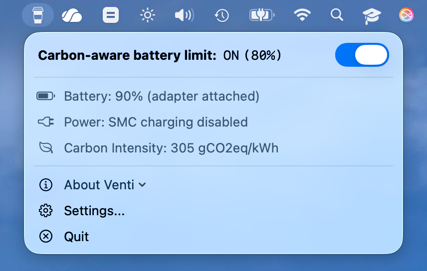
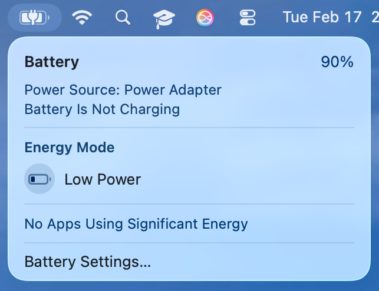
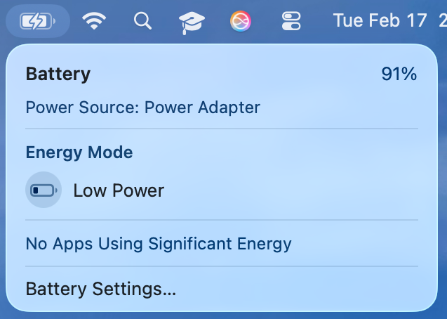

# Venti
## Carbon-aware Battery Management<br> for Apple Silicon MacBooks

 Venti is meant for MacBooks which are plugged into a power source most of the time.  It fulfills two design goals simultaneously: first, it keeps the battery charged to `80%`, which helps prolong its longevity.  Second, when the battery percentage does drop below `80%`, Venti uses carbon intensity data from [CO2signal](https://www.co2signal.com) to *defer* charging until grid electricity is sufficiently clean, reducing your carbon footprint.

Venti is free, open-source, and heavily based on an [existing tool](https://github.com/actuallymentor/battery/) by Mentor Palokaj.

> Want to know if this tool does anything or is just a placebo? Read [this article](https://batteryuniversity.com/article/bu-808-how-to-prolong-lithium-based-batteries). TLDR: keep your battery cool, keep it at 80% when plugged in, and discharge it as shallowly as feasible.

### Requirements

This is an app for Apple Silicon MacBooks. It will not work on Intel Macs because the System Management Controller (SMC) is fundamentally different.  If you have an Intel Mac and are looking for a solution to maintain your battery, consider the [AlDente](https://apphousekitchen.com/) app.  It is a good alternative and has a premium version with many more features.

### Installation

- Option 1: [You can download the latest version here (notarized .dmg)]( https://github.com/adamlechowicz/venti/releases/ ).
- Option 2: command-line only installation (see section below)

The first time you open the app, it will ask for your administator password so it can install the needed components. Please note that the app:

- Disables charging when your battery is above 80% charged
- Enables charging when your battery is under 80% charged and grid carbon emissions are low
- While your device is plugged into a power source, the battery will not discharge (by default)
- Keeps the limit engaged even after rebooting
- Keeps the limit engaged even after closing the tray app
- Also automatically installs the `venti` command line tool. If you want a custom charging percentage, the CLI is the only way to do that.

Do you have questions, comments, or feature requests? [Open an issue here](https://github.com/adamlechowicz/venti/issues) or [Email me](mailto:alechowicz@umass.edu).

---


## 🖥 Command-line version

> If you don't know what a "command line" is, ignore this section. You don't need it.

The GUI app uses a command line tool under the hood. Installing the GUI automatically installs the CLI as well. You can also separately install the CLI.

The CLI is used for managing the battery charging status for M1 Macs. Can be used to enable/disable the MacBook from charging the battery when plugged into power.

### Installation

One-line installation:

```bash
curl -s https://raw.githubusercontent.com/adamlechowicz/venti/main/setup.sh | bash
```

This will:

1. Compile the `smc` tool from the [hholtmann/smcFanControl]( https://github.com/hholtmann/smcFanControl.git ) repository
2. Install `smc` to `/usr/local/bin`
3. Install `venti` to `/usr/local/bin`

### Usage

Example usage:

```shell
# This will disable charging when your battery meets or exceeds 80%, 
# and enable it when it falls below 80%, as long as carbon emissions are low
venti maintain 80
```

After running a command like `venti charging off` you can verify the change visually by looking at the battery icon:



After running `venti charging on` you will see it change to this:




For help, run `venti help` or `venti` without parameters:

```
Venti CLI v1.0

Usage:

  venti status
    output battery SMC status, % and time remaining

  venti logs LINES[integer, optional]
    output logs of the venti CLI and GUI
	eg: venti logs 100

  venti maintain LEVEL[1-100,stop]
    reboot-persistent battery level maintenance: turn off charging above, and on below a certain value
    eg: venti maintain 80
    eg: venti maintain stop

  venti charging SETTING[on/off]
    manually set the battery to (not) charge
    eg: venti charging on

  venti adapter SETTING[on/off]
    manually set the supply of power from adapter (off means battery will drain even when plugged in)
    eg: venti adapter off

  venti charge LEVEL[1-100]
    charge the battery to a certain percentage, and disable charging when that percentage is reached
    eg: venti charge 90

  venti discharge LEVEL[1-100]
    block power input from the adapter until battery falls to this level
    eg: venti discharge 90

  venti fix-region {region/False}
    manually fix the location queried for carbon intensity from Electricity Map.
    see https://api.electricitymap.org/v3/zones for a full list of regions
    to use dynamic location based on IP: venti fix-location False
    to use fixed location: venti fix-location ES-CE

  venti set-api-key {APIKEY}
    set your own (free!) API key, used to query for carbon intensity from CO2signal. 
    there is a default key, but depending on how popular this tool becomes, it may hit the request limit.
    you can get your own free key and never deal with these issues by visiting https://www.co2signal.com.
    eg: venti set-api-key 1xYYY1xXXX1XXXxXXYyYYxXXyXyyyXXX

  venti visudo
    instructions on how to make which utility exempt from sudo, highly recommended

  venti update
    update the venti utility to the latest version

  venti reinstall
    reinstall the venti utility to the latest version (reruns the installation script)

  venti uninstall
    enable charging, remove the smc tool, and the venti script
```

## Why does this exist?

I was using AlDente to preserve the longevity of my MacBook's battery, and the [Clean Energy Charging](https://support.apple.com/en-us/HT213323) feature available on iOS caught my eye.

I found the existing and open-source [battery utility](https://github.com/actuallymentor/battery), which provided all of the basic system interactions needed to implement "Clean Energy Charging" functionality for the Mac.  After implementing the CO2signal API and some other tweaks, I arrived here.

## "It's not working"

Please [open an issue](https://github.com/adamlechowicz/venti/issues/new) and I'll try to address it whenever I have some time!
