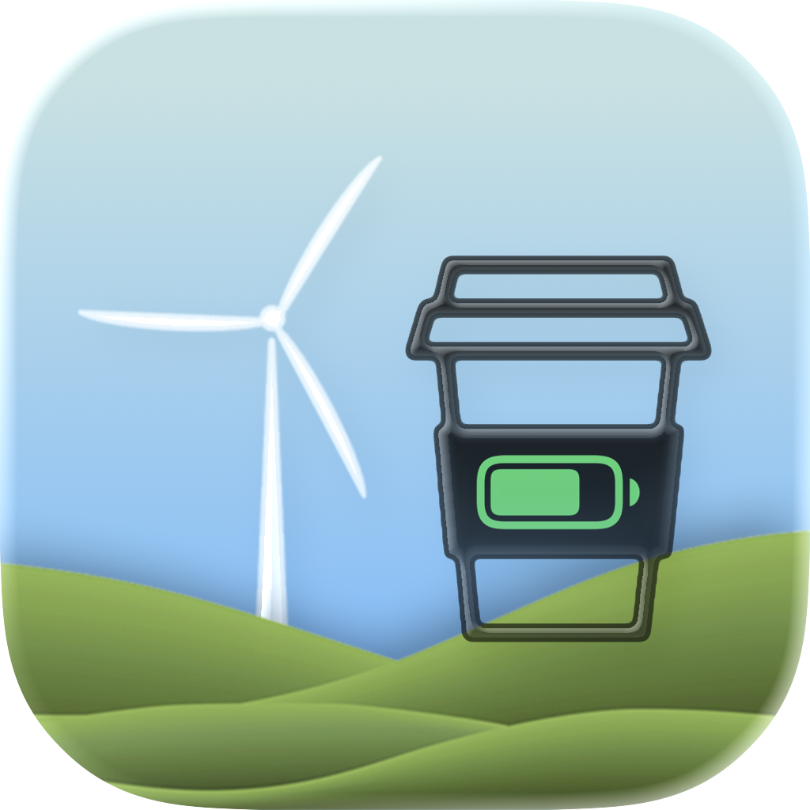
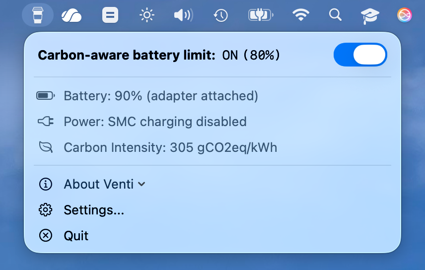
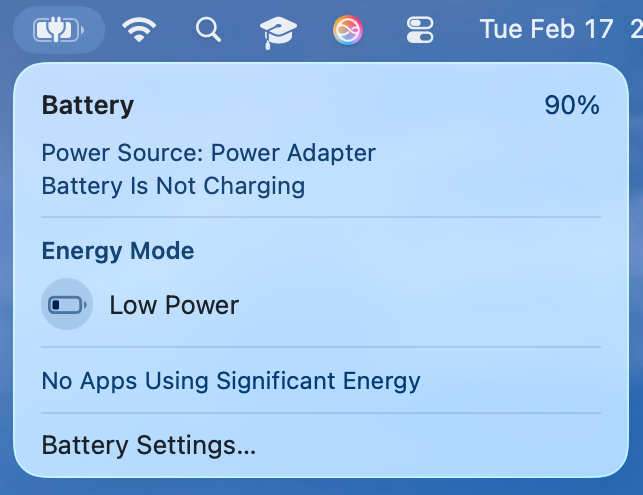
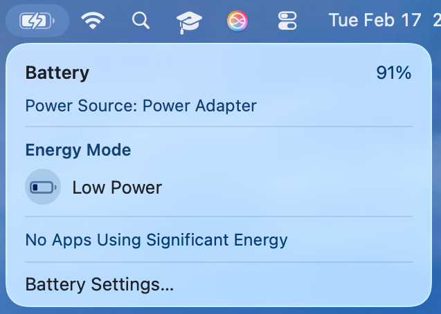

# Venti
## Carbon-aware Battery Management  for Apple Silicon MacBooks

 Venti is meant for MacBooks which are plugged into a power source most of the time.  It fulfills two design goals simultaneously: first, it keeps the battery charged to `80%`, which helps [prolong its longevity](https://batteryuniversity.com/article/bu-808-how-to-prolong-lithium-based-batteries).  Second, when the battery percentage does drop below `80%`, Venti uses carbon intensity data from [Electricity Maps](https://www.electricitymaps.com) to *defer* charging until grid electricity is sufficiently clean, reducing your carbon footprint.

Venti is free, open-source, and heavily based on an [existing tool](https://github.com/actuallymentor/battery/) by Mentor Palokaj.

### Requirements

This is an app for Apple Silicon MacBooks. It will not work on Intel Macs because the System Management Controller (SMC) is fundamentally different.  If you have an Intel Mac and are looking for a solution to maintain your battery, consider the [AlDente](https://apphousekitchen.com/) app.  It is a good alternative and has a premium version with many more features.

### Installation

[Download the latest version here (notarized .dmg)]( https://github.com/adamlechowicz/venti/releases/ ).

The first time you open the app, it will ask for your administator password so it can install the needed components. Please note that the app:

- Disables charging when your battery is above 80% charged
- Enables charging when your battery is under 80% charged and grid carbon emissions are low
- While your device is plugged into a power source, the battery will not discharge (by default)
- Keeps the limit engaged even after rebooting
- Keeps the limit engaged even after closing the tray app
- Allows setting a custom charging limit (other than 80%) using settings.

Do you have questions, comments, or feature requests? [Open an issue here](https://github.com/adamlechowicz/venti/issues) or [Email me](mailto:alechowicz@umass.edu).

### Charging behavior

You can verify that charging is disabled by looking at the battery icon in the macOS menu bar:

When charging is enabled, you will see it change to this:

---

## Why does this exist?

I was using AlDente to preserve the longevity of my MacBook's battery, and the [Clean Energy Charging](https://support.apple.com/en-us/HT213323) feature available on iOS caught my eye.

I found the existing and open-source [battery utility](https://github.com/actuallymentor/battery), which provided all of the basic system interactions needed to implement "Clean Energy Charging" functionality for the Mac.  After implementing the Electricity Maps API and some other tweaks, I arrived here.

In the 2.0 release, Venti has been fully refactored using native SwiftUI (prior versions of Venti used Electron).

## "It's not working"

Please [open an issue](https://github.com/adamlechowicz/venti/issues/new) and I'll try to address it whenever I have some time!
